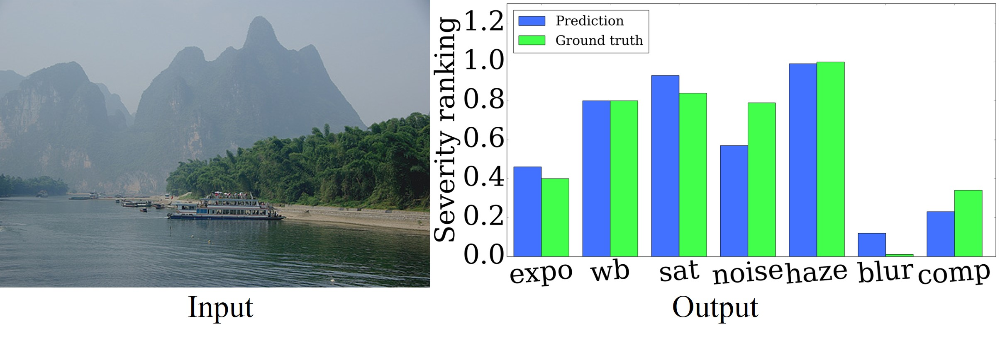

# DefectDetection



- Caffe implementation for our [WACV'18 paper](https://arxiv.org/pdf/1612.01635.pdf) ([supplemental](https://drive.google.com/file/d/1J3suq5UnSjCZGEkrqCHTnKUPlg505p7f/view?usp=sharing)) on multiple photographic defect detection.
- Contact: Ning Yu (ny4kt AT virginia DOT edu)

## Prerequisites
- Linux
- NVIDIA GPU + CUDA CuDNN
- Caffe

## Dataset
- Training image addresses and seven defect severity ground truth are in the file data/train/defect_training_gt.csv.
- Testing image addresses and seven defect severity ground truth are in the file data/test/defect_testing_gt.csv.

## Network Architectures (visualize from [ethereon](http://ethereon.github.io/netscope/quickstart.html))
- Multi-column holistic-input GoogLeNet is in the file prototxt/GoogLeNet/holistic/deploy_holistic.prototxt.
- Multi-column patch-input GoogLeNet is in the file prototxt/GoogLeNet/patch/deploy_patch.prototxt.

## Pre-trained Models
- [Multi-column holistic-input GoogLeNet model](https://drive.google.com/file/d/1NuSvKbIY7tqdcN_H8XBXGwrNJGDJ_Xue/view?usp=sharing) (download and put it under model/GoogLeNet/)
- [Multi-column patch-input GoogLeNet model](https://drive.google.com/file/d/1EJyA-CsXLe_lmnxd8pO-E47qcogoFVEV/view?usp=sharing) (download and put it under model/GoogLeNet/)

## Infogain Weights
- If users launch their own training or testing with the [infogain loss](http://caffe.berkeleyvision.org/doxygen/classcaffe_1_1InfogainLossLayer.html) as Eq. 1 in our [paper](https://arxiv.org/pdf/1612.01635.pdf), they can use our pre-computed weights at data/infogain_mat/, which follows the formulation as Eq. 4 in our [supplemental material](https://drive.google.com/file/d/1J3suq5UnSjCZGEkrqCHTnKUPlg505p7f/view?usp=sharing).

## Testing
- First download testing images from the addresses in the first column in the file data/test/defect_testing_gt.csv into data/test/original_resolution/.
  Or put customized images into that directory.
- Then run
```
python test.py -iPath ./data/test/original_resolution -oPath ./output/GoogLeNet -holisticDeployPath ./prototxt/GoogLeNet/holistic/deploy_holistic.prototxt -holisticWeightsPath ./model/GoogLeNet/weights_holistic.caffemodel -patchDeployPath ./prototxt/GoogLeNet/patch/deploy_patch.prototxt -patchWeightsPath ./model/GoogLeNet/weights_patch.caffemodel -gpu 0
```
- The final seven defect severity prediction results are saved in the file output/GoogLeNet/defect_scores_combined.csv.
- Testing images are sorted in the descent order according to each defect severity prediction and visualized correspondingly to the file output/GoogLeNet/defect_scores_combined_*.html.

## Citation
```
@inproceedings{WACV-2018,
    author = {Yu, Ning and Shen, Xiaohui and Lin, Zhe and Měch, Radomír and Barnes, Connelly},
    title = {Learning to Detect Multiple Photographic Defects},
    booktitle = {IEEE Winter Conference on Applications of Computer Vision},
    year = {2018}
}
```
## Acknowledgement
- This research is supported by Adobe Research Funding.
- This code borrows heavily from the popular [caffe-googlenet-bn](https://github.com/lim0606/caffe-googlenet-bn) repository.

## Note
- It is for non-commercial research purpose only. Adobe has been filing a patent for this work.
